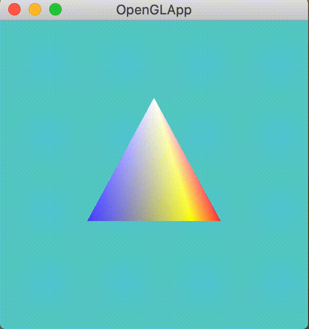
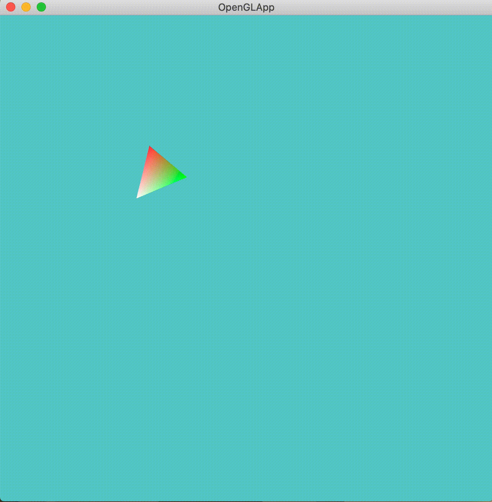
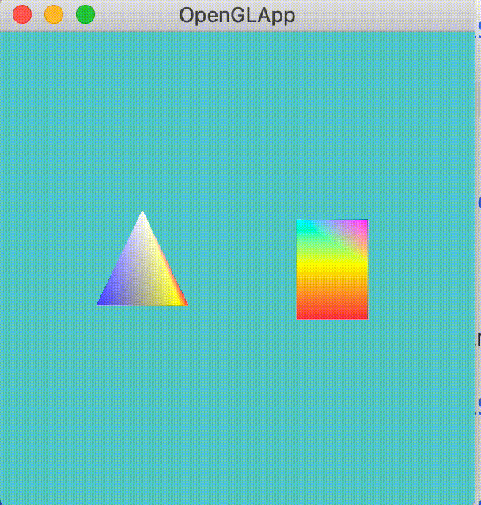
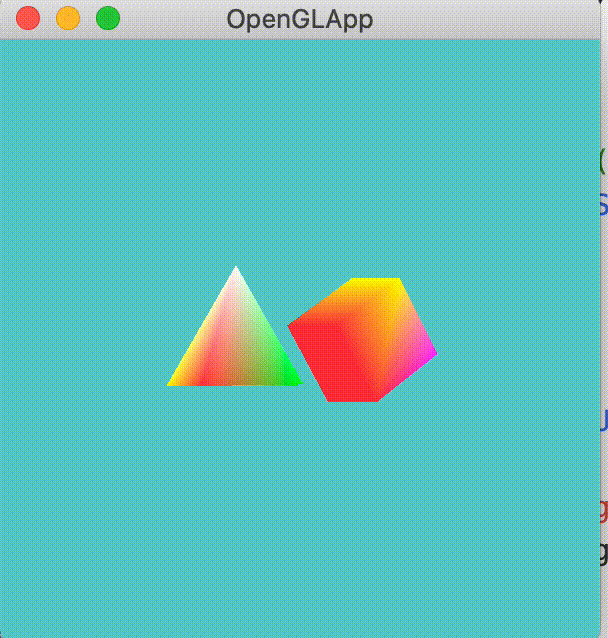

# openGL_learn
- 드립커피+한모금더 강사님의 openGL 인프런 강의(https://www.inflearn.com/course/%EA%B2%8C%EC%9E%84%EA%B0%9C%EB%B0%9C-graphics-shader-opengl-1) 실습 레포입니다.

- 실습환경은 iMac (Retina 5K, 27-inch, 2019), 3.1 GHz 6-Core Intel Core i5
- openGL 4.1 로 진행하였습니다.
- Build tool : CMake

## Pyramid 회전 exercise (Chapter 3)
### openGL program
- EBO를 통해 효과적인 버텍스 사용 진행.
- chrono를 통한 렌더 타임 체크로 걸린 시간에 비례하여 회전되게 설정.
- 'R' 키 press에 lastTime 업데이트로 theta 값 초기화.
- `GL_CULL_FACE` enable 을 통해 파이프라인 상에 필요없는 프리미티브 축출.
- 카메라 위치 등 상황에 따라 달라질 수 있는 CullFace를 cullMode 변수 세팅을 통해 설정할 수 있도록 switch-case 문 활용.

### shader
- 기본 버텍스 위치와 각도를 vertex shader로 전달하여 쉐이더에서 회전변환 계산이 진행되도록 설정.
- openGL 특징 상 오른손, 왼손 좌표계를 혼용하는 것에 대응하여 z direction에 대해서 negate 진행.

### 결과

- y 축 기준으로 회전하는 피라미드 생성.

---

## 2D 회전변환 적용 exercise (Chapter 4)
### openGL program
- 궤도를 도는 렌더링을 위해 회전각과 시작 오프셋 값을 유니폼으로 전달

### shader
- 전달받은 버텍스 좌표에 시작점 오프셋 값을 합한 뒤 회전각 만큼 회전변환시켜서 원 궤도를 돌아가는 것으로 만듦.

### 결과

---

## 3D 회전변환 적용 exercise (Chapter 4)
### openGL program
- 앞서 구현한 피라미드를 y축 뿐만 아니라 다른 축을 기준으로 회전시키기
- 키보드 콜백으로 QAZ, WSX, EDC 로 각 축 회전 방향 dir값 세팅
- updateFunc() 에서 회전행렬을 계산 진행. Post-Multyplied 고려하여 glm::rotate 사용 (회전변환 순서 X축 -> Y축 -> Z축)
- 유니폼 변수로 회전행렬을 보내 쉐이더에서 계산 진행

### shader
- gl_Position으로 버텍스와 회전행렬 곱을 진행하여 진행

## 결과
+X -> -X -> +Y -> -Y -> +Z -> -Z 순

---

## Virtual trackball with GLM exercise(chapter 4)
### openGL program
#### mouseCallback 
- cursorPosFunc, mouseButtonFunc 사용.
- mouseButtonFunc로 마우스 누른 순간의 스크린좌표 기록(dragStart)
- 이후 cursorPosFunc로 마우스가 움직인 위치 좌표를 dragCur로 기록.
- calTrackball 함수로 처음->현재 위치 이동에 대한 회전 쿼터니언 생성하여 행렬변환.
- GLFW_RELEASE 되면 놓은위치 기록하고 처음->끝에 대한 회전 쿼터니언 생성하여 기존 Updated된 행렬과 합성
- 그렇게 합성된 행렬로 matUpdated를 갱신.

- 결국 가상의 3차원 트랙볼 상의 좌표를 만들고, 마우스 시작 - 끝 위치를 향하느 벡터에 대해 두 벡터가 이루는 각 theta와, 두 벡터로 만들어지는 외적벡터 v을 통해 쿼터니언 q = (sin(theta/2)*v, cos(theta/2)) 로 나타남.
- 쿼터니언을 임의의 상황에 대한 회전변환으로 활용.

#### trackball
- calcTrackball 함수에서 시작 -> 현재 위치에 대한 3차원 구 상의 벡터를 생성하여 glm::rotation 함수로 쿼터니언 생성, 생성된 쿼터니언은 glm::toMat4로 행렬형태로 변환
- calcUnitVec 함수는 스크린 상의 2차원 좌표점을 받아서 canonical view volume 공간의 좌표로 변환 후, 이를 radius로 나누어 크기 1인 유닛 벡터로 만들어줌.

### shader
- 쿼터니언으로 구해진 회전행렬을 유니폼으로 전달받아 버텍스 곱해 위치를 조정함.

## 결과

---

## Model transformation exercise(chapter 5)
### openGL program
- 피라미드 모형과 박스 모형이 한 씬에 같이 보이도록 배치
- 각각의 vbo를 선언하고 피라미드 드로우 -> 박스 드로우하여 씬 완성
- 피라미드는 y축 회전, 박스는 x축 회전을 걸었음.
- 박스가 예상과 달리 x축에 대해 반대로 회전하는 문제가 있었는데 cull_face 옵션 문제로 축출되어 반대로 회전하는 것으로 보였던 것이었음.
- 축출 기능을 끄니 원래대로 잘 나타나는 것 확인함. 
- 각 물체 별로 움직여야하는 위치, 각도가 다르니 이에 맞게 물체 별로 모델 트랜스폼 매트릭스를 유니폼으로 쉐이더에 전달하였음.

### shader
- vertex shader에서 전달받은 오브젝트의 좌표에 모델 트랜스폼을 진행시켜서 월드좌표 상에 원하는 위치로 이동시켰음.

## 결과

---

## View transformation exercise (chapter 5)
### openGL program
- view transform에 해당하는 행렬을 직접 만들어서, 카메라가 물체 주변을 원 궤도로 돌 때 매 이미지를 렌더링하였음.
- 뷰 매트리스를 업데이트 함수에서 계산하여 쉐이더로 유니폼 변수로 전달하여 계산하게 함.

### shader
- vertex shader에서 뷰 트랜스폼에 대한 계산 + 모델 트랜스폼에 대한 계산 진행

## 결과

---

## View trasnformation exercise (chapter 5)
### openGL program
- view matrix를 glm::LookAt 함수를 활용하여 EYE, AT, UP 벡터를 전달하는 식으로 뷰 매트릭스 전달.
- 사용자가 일일히 뷰 매트릭스를 구현하지 않아도 편리하였음.

결과는 위와 동일.

---

## View transformation exercise (chapter 5)
### openGL program
- perspective transform을 통해 원근감 있는 렌더링을 진행하였음.
- glm::frustum 함수를 통해 뷰 프러스텀 영역을 설정하고 그에 해당하는 perspective transform matrix를 반환하게 함.
- 유니폼 변수로 넘겨서 버텍스 쉐이더에서 계산 진행.
- 비율 4:3 으로 만들고 그에 맞게 프러스텀 x,y 값을 설정하여 늘어지지 않게 함.(x: -1~1, y:-0.75 ~0.75)

## 결과

- 멀어짐에 따라 원근감이 느껴지게 됨.

---

## Minimap using viewport, scissor box exercise (chapter 5)
### openGL program
- 뷰포트로 NDC의 출력을 윈도우 상의 특정 영역에 출력되게끔 제한할 수 있는 성질을 이용하여 미니맵같이 만들어봄.
- 미니맵과 원래화면 사이의 clearcolor를 다르게하였고, 미니맵의 clearcolor가 원래화면을 glClear 과정에서 다 덮어씌우지 않도록, scissor box를 활용하여 업데이트할 영역만 제한하여 clear시킴.
- 완벽한 미니맵 형태는 아니나, 이런 테크닉을 통해 게임 상의 미니맵, 혹은 거울이미지 등을 렌더링할 수 있음을 알게되었음.
- 초기 설정해두었던 종횡비로 렌더링 가능한 최대 크기(vp)를 현재 윈도우 사이즈에 맞게 구해주고, 렌더링을 현재 윈도우의 중앙에 진행함
- 이후 양 옆 혹은 양 위아래로 남는 영역은 glclear한 영역을 찍어주도록 함.
- 윈도우 비율이 깨지더라도 기존에 설정하고자 했던 비율이 유지됨.
- glScissor, glViewport는 사용했으면 바로바로 리셋해서 추후 렌더링에 영향을 주지 않도록 함.

## 결과

